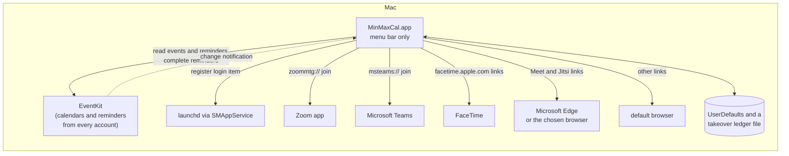
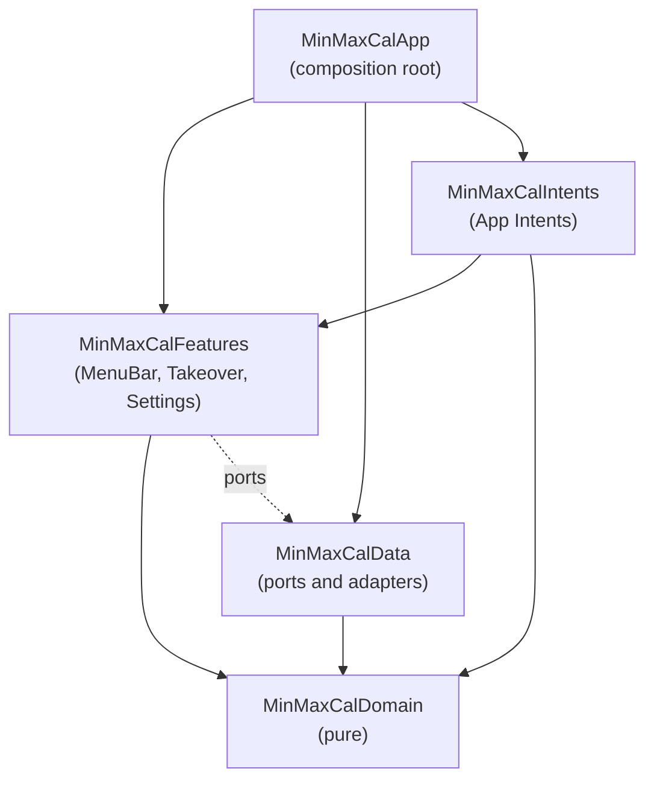

# MinMaxCal Architecture

How MinMaxCal works under the hood. [README.md](README.md) owns what it
does and why; this document owns the system design. The feature groups
referenced here (Glance, Agenda, Takeover and Always there) are the
README's Features subsections and Settings is its Configuration section.

## Overview

MinMaxCal is a native SwiftUI macOS menu bar app (macOS 27 or later,
Swift 6.4, AGPL-3.0) that shows the next calendar event or reminder in
the menu bar, lists the coming agenda on click and takes over every
display when something is due. It is developed readme-first: this
document describes the target system and slices of it land in the order
given in the README's Status section.

The architectural thesis, referenced throughout: **MinMaxCal owns no
calendar data**. EventKit is the source of truth for every event,
reminder, attendee and calendar; the app reads it on demand, converts it
to its own value types and keeps nothing of it. What the app persists is
its own: which calendars are selected, the matching rules and a small
ledger of takeovers already dismissed or snoozed. Killing, crashing or
updating the app loses at most a snooze.

## System context



Boundary facts the design relies on:

- EventKit needs full access to events and to reminders, granted per app
  by the user through TCC. Full access is required: write-only access
  cannot list anything and completing a reminder is a write.
- The app runs as a UI element (`LSUIElement`), so it never shows in
  the Dock or the Cmd-Tab switcher and its only standing UI is the menu
  bar item. Settings and the takeover are windows the app activates
  itself to show.
- Nothing leaves the Mac. The app has no network code; the join links
  it opens are handed to other apps.

## Guiding principles

1. **P1: Derive, don't own.** EventKit is the source of truth. The app
   re-reads it on every change notification, every minute and every
   wake, and never caches event data across launches.
2. **P2: Pure rules.** Merging, truncation, countdowns, link detection,
   acceptance and takeover timing are pure functions over value types,
   unit tested without EventKit or a window.
3. **P3: Compiler-enforced boundaries.** Clean architecture mapped onto
   SPM targets; an illegal dependency is a build failure, not a review
   comment.
4. **P4: Approachable strict concurrency.** MainActor by default in UI
   targets, nonisolated core, one actor around EventKit, structured
   tasks everywhere.
5. **P5: System APIs only.** Anything the public frameworks do not
   expose is either computed from what they do expose by a rule written
   down in the README, or left out; private API is never called.
6. **P6: Calendar data is untrusted input.** Titles, notes and URLs come
   from invitations anyone can send. Link detection only ever produces
   URLs with known schemes and hosts, and notes render as text, HTML
   reduced to its characters and web anchors.

## Process model and lifecycles

The app process is the only process. It starts at login as a login item
(`SMAppService.mainApp`), stays resident as a menu bar item and quits
only from the agenda's footer. There is no helper, no daemon and no
notification spool: a takeover needs the app running, which is what
launch at login is for. A takeover whose moment passed while the app was
not running is still shown on launch when the moment is within the last
ten minutes (the README's rule), so a crash or an update during a
meeting's first minutes still surfaces it; while the app runs, anything
that fell due since the scheduler last ran fires on the next rebuild,
however long the Mac slept.

### Activation

`LSUIElement` is set in `Info.plist`, so the activation policy is
accessory from launch. The `MenuBarExtra` scene is the root; its window
style (`.menuBarExtraStyle(.window)`) hosts the agenda as SwiftUI rather
than as menu items, which is what allows checkboxes, join buttons and
colour marks in rows. Opening Settings or a takeover calls
`NSApp.activate()` first, since an accessory app's windows otherwise
open behind the frontmost app.

### Refresh cadence

One `AgendaModel` (MainActor) owns the current `Agenda` and rebuilds it
from the calendar port whenever any of these fire, merged into one
`AsyncStream` so there is exactly one consumer loop:

- `EKEventStoreChanged` (any calendar or reminder changed, in any app);
- the minute boundary (for the countdown, past-event pruning and the
  next takeover);
- `NSWorkspace.didWakeNotification` (the minute timer may have slept
  through several boundaries);
- `NSSystemClockDidChange`, `NSSystemTimeZoneDidChange` and
  `NSCalendarDayChanged` (the clock was set, as NTP does after a wake,
  or the Mac landed in another time zone: every displayed time and the
  planned takeover moment are stale, and the minute timer and alarm are
  sleeping for a duration computed against the old clock, so the
  rebuild re-plans them at once);
- the selection or matching rules changing in Settings;
- a reminder completed or a takeover dismissed from the app's own UI.

Each rebuild fetches today and tomorrow for the selected calendars
and lists, converts to Domain values inside the EventKit actor, runs the
pure merge and filter rules and publishes the new `Agenda`. The menu bar
title, the agenda list and the takeover scheduler all derive from that
one value.

Three rules keep an idle minute cheap. The merged trigger stream keeps
only the newest pending element (`bufferingNewest(1)`), so a burst of
sync notifications during a rebuild costs one more rebuild, not one per
notification. The minute tick sleeps with a five-second tolerance so
the system can coalesce the wake-up with others; a tolerance only ever
lands late, never before the boundary. And a rebuild assigns only the
values that changed, so a minute in which nothing moved re-renders the
countdown alone. The fetch itself stays: calendar and reminder data is
re-read every minute by decision.

## Package architecture

One root `Package.swift` defines every library target; a thin app shell
in `App/` is generated into an Xcode project by XcodeGen (`project.yml`
is committed, the `.xcodeproj` is gitignored).



- **MinMaxCalDomain**: entities and pure logic. Entities: `CalendarList`
  (identifier, title, colour, kind event or reminder, account name),
  `AgendaItem` (an event or a reminder: the set of member identifiers
  and occurrence dates it merged from, title, start, end, all-day, the
  calendars it is in, location, notes, URL, organiser, attendees with
  their responses, the current user's response, acceptance and the
  detected `JoinLink`), `JoinLink` (Zoom, Teams, Meet, Jitsi, FaceTime or other
  with the web URL to open and, for Zoom and Teams, the `zoommtg://`
  or `msteams://` deep link built from its meeting id and passcode as
  well), `JoinApp` (an installed
  app's bundle identifier and name), `Agenda` (items in time order
  with a horizon), `Takeover` (an item, its trigger and the moment it
  fires), `MatchingRules`, `Selection` and `JoinSettings` (which app,
  by bundle identifier, opens each service's links, nil being the
  default browser; value types Settings edits). Logic: `AgendaMerger`,
  `AgendaFilter`
  (past, declined, cancelled, completed, all-day and undated rules),
  `Acceptance`, `MenuBarTitle` (middle truncation by grapheme cluster),
  `Countdown` (two largest units, `<1m`, `now`, to the start or to the
  end of whatever is in progress), `JoinLinkDetector` (holding its
  `NSDataDetector` as a static, since every event's fields pass
  through it on every rebuild)
  and `TakeoverPlanner` (the next `Takeover` given an agenda, the
  ledger, the clock and the settings). `TakeoverLedger` and
  `TakeoverSettings` (the switches, the `TakeoverSound`, a name for
  `NSSound` that is Glass by default, or none, and the snooze
  durations) are Domain values too, so the planner is pure.
  Foundation value types (Date, URL and Data) are allowed; EventKit,
  AppKit, process, file and network APIs are banned.
- **MinMaxCalData**: protocol ports with adapter implementations.
  `CalendarSource` (`requestAccess`, `accessStatus`, `lists`,
  `agenda(from:to:selection:)`, `complete(reminder:)`, `changes`)
  with `EventKitCalendarSource`, whose decoder runs `JoinLinkDetector`
  over every item; `LoginItem` with `SMAppServiceLoginItem`;
  `LinkOpener` with
  `WorkspaceLinkOpener` (`open(_:in:)` opens a link in the app with a
  bundle identifier, the deep link when that app is the service's
  own, falling back to the default handler when the choice is nil or
  the app is not installed; `apps(for:)` lists the service's own app
  when installed, then the installed handlers of `https://` through
  `NSWorkspace.urlsForApplications(toOpen:)`);
  `SettingsStore` over `UserDefaults`, MainActor-isolated because
  `UserDefaults` is not `Sendable` on the macOS 27 SDK, holding the
  decoded values in memory and writing through so a read never decodes
  JSON; and `TakeoverLedgerStore`, which reads the `TakeoverLedger`
  JSON file once, serves it from memory behind a `Mutex` (it is the
  file's only writer) and writes through on every save, pruning
  anything older than a day. One module, split only if boundary
  violations appear.
- **MinMaxCalFeatures**: SwiftUI views and `@Observable` view models,
  MainActor by default, given ports via injection. Three folders, one
  per surface: `MenuBar` (the label, the agenda list and `AgendaModel`;
  `LinkedText` converts each notes string once and keeps the result,
  since AppKit's HTML importer is slow, main-thread bound and asked
  for the same notes by every takeover window at once),
  `Takeover` (`TakeoverModel`, the panel view and the AppKit window
  controller that puts one borderless window on each screen) and
  `Settings` (the six tabs and `SettingsModel`, which lists the
  takeover sounds by reading the audio files, by `UTType`, of the
  account's `~/Library/Sounds` rather than the sandbox container's,
  which the app sandbox lets it read, then `/Library/Sounds` and
  `/System/Library/Sounds`, and lists per service the apps
  `LinkOpener` finds, keeping a chosen app that is no longer installed
  in the list so the picker never goes blank; the list fields are
  `TextField`s over `ListField`'s `ParseableFormatStyle`s, so they
  commit when editing ends rather than on every keystroke). Split into
  targets if one surface grows a dependency the others must not see.
- **MinMaxCalIntents**: the App Intents and the `AgendaItemEntity`
  they return, reaching `AgendaModel` and `TakeoverModel` through
  `AppDependencyManager`. Its own target because `AppIntent` is
  `Sendable` and `perform()` nonisolated, so an intent cannot be a
  MainActor type, and `nonisolated` on a struct rejects the `@Property`
  and `@Dependency` wrappers it needs: the target is nonisolated by
  default and each intent hops to the main actor to call one model
  method. Every rule it needs, which item is next, which has a call,
  which reminder is first, lives on the models where the tests reach
  it. The entity carries the title, kind, times, countdown and
  detector-vetted join link and nothing else the invitation wrote
  (P6).
- **MinMaxCalApp**: builds adapters, injects ports, declares the
  `MenuBarExtra` and `Settings` scenes, registers the models with
  `AppDependencyManager`, names the Features intents package and the
  App Shortcuts phrases (which must sit in the app bundle) and owns
  the single refresh loop. No logic.

Third-party imports: none. System frameworks are confined (P3):

| Framework | Only importable in |
|---|---|
| EventKit, ServiceManagement | MinMaxCalData |
| AppKit | MinMaxCalData (`NSWorkspace`) and MinMaxCalFeatures (windows) |
| AudioToolbox, UniformTypeIdentifiers | MinMaxCalFeatures (the takeover sound) |
| SwiftUI | MinMaxCalFeatures and MinMaxCalApp |
| AppIntents | MinMaxCalIntents and MinMaxCalApp (App Shortcuts) |

## Concurrency model

| Target | Default isolation | Notes |
|---|---|---|
| MinMaxCalDomain | nonisolated | Sendable value types by construction |
| MinMaxCalData | nonisolated | one actor, `EventKitCalendarSource` |
| MinMaxCalFeatures | MainActor | `@Observable` MainActor view models |
| MinMaxCalIntents | nonisolated | `Sendable` intents hopping to the main actor |
| MinMaxCalApp | MainActor | wiring only |

All targets build with `SWIFT_DEFAULT_ACTOR_ISOLATION` set per the table,
`SWIFT_APPROACHABLE_CONCURRENCY=YES` and the Swift 6 language mode.

Exactly one actor is sanctioned: `EventKitCalendarSource`. `EKEventStore`
may be used from any thread but `EKEvent`, `EKReminder` and `EKCalendar`
objects must not cross threads, so the actor owns the store, performs
every fetch and write, and converts to Domain values before returning;
no EventKit object ever leaves it. Any further actor needs a written
justification here. `TakeoverLedgerStore` guards its in-memory ledger
with a `Mutex` from `Synchronization` rather than a second actor,
because its callers are synchronous and the critical section is a
copy. `@unchecked Sendable` and `nonisolated(unsafe)` are banned.

Under approachable concurrency, `nonisolated async` functions run on the
caller's actor, so the ports are plain `nonisolated async` and nothing
is marked `@concurrent`: the heaviest work is merging a day of events,
which is not worth moving off the main actor.

Events flow as `AsyncStream`s (the store's change notification, the
minute tick, the system changes of wake, clock, time zone and day, and
settings changes) consumed by `AgendaModel.run()`,
which the app starts in one `Task` from its initialiser: a menu bar app
has no view that is reliably alive to host the loop as a `.task`, and
modifiers on the `MenuBarExtra` label never run. The task lives as long
as the process. `run()` merges the streams in one task group and
rebuilds on every element.
The takeover scheduler is one `Task` stored on `TakeoverModel`,
sleeping until the planned moment, cancelled and replaced on every
agenda rebuild, so a changed or deleted event can never fire a stale
takeover. The only other unstructured tasks bridge
`NotificationCenter` sequences into the streams and run the async
Complete action from SwiftUI button callbacks.

## Key data flows

### Permissions and selection (Settings)

1. First launch calls `requestFullAccessToEvents` then
   `requestFullAccessToReminders`. `Info.plist` carries
   `NSCalendarsFullAccessUsageDescription` and
   `NSRemindersFullAccessUsageDescription`. Denied or restricted access
   shows in the General tab with a button opening the Privacy pane; the
   app keeps running with whatever it has.
2. The Calendars tab lists `calendars(for: .event)` and `.reminder`
   grouped by `EKSource` title. Selection is stored as two sets of
   `calendarIdentifier` strings. Identifiers can change when an account
   is removed and re-added; a selected identifier that no longer exists
   is dropped silently on the next rebuild and the tab shows the
   calendar unselected, which is the honest state.
3. Nothing is selected by default. An empty selection yields an empty
   agenda and the icon alone in the menu bar, and the agenda's empty
   state links to Settings.

### Building the agenda (Glance and Agenda)

1. The actor fetches events with `predicateForEvents(withStart:end:
   calendars:)` from the start of today to the end of tomorrow and
   incomplete reminders with `predicateForIncompleteReminders(
   withDueDateStarting:ending:calendars:)` from the distant past to
   the end of tomorrow, so overdue reminders are included.
2. Each `EKEvent` becomes an `AgendaItem` member: the identity is
   `calendarItemIdentifier` plus `occurrenceDate` (recurring events
   share the former), the invite identity is
   `calendarItemExternalIdentifier`, acceptance follows `Acceptance`
   (the attendee with `isCurrentUser` is `.accepted`, or the organiser
   is the current user, or there are no attendees), and
   `JoinLinkDetector` runs over `url`, `location` and `notes`.
3. `AgendaFilter` drops cancelled events (`status == .canceled`), events
   the current user declined, events whose end has passed and completed
   reminders; all-day events and reminders without a due time stay in
   the agenda but are excluded from the title and from takeovers.
4. `AgendaMerger` groups by invite identifier first, then by exact
   start and end where titles are equal after trimming and case folding
   or one side is in `MatchingRules.genericTitles`. A group with two
   distinct specific titles splits into one item per specific title,
   generic members attaching to the first by calendar order. The merged
   item's title is the longest specific title and its calendars are
   the union; location, notes, URL, organiser, attendees, the user's
   response and acceptance come from the members with a specific title
   (or from every member when none has one), in calendar order, so a
   generic copy is never the source of truth for an invitation.
   Acceptance is true when any such member is accepted, since the user
   accepted the meeting somewhere.
5. `AgendaFilter.named` then drops any event left with only a generic
   title, since a lone `Busy` block is not a meeting and several never
   combine into one, and the result is sorted by start, reminders and
   events interleaved, and published as the new `Agenda`.

### The menu bar title (Glance)

`MenuBarTitle.render(agenda:now:limit:)` picks the first timed,
incomplete item that is either an event which has not ended or a
reminder no more than one hour overdue. It truncates the title in the
middle to the configured limit (24 grapheme clusters by default, a
single `…` between the kept head and tail) and appends
`Countdown.text(for:now:)`, which counts down to the start, or to the end
once an event has started. Once a reminder is due, `Countdown` continues
to return `now`, but `MenuBarTitle` keeps it eligible for only one hour;
older incomplete reminders remain in the agenda while the menu bar
moves on. The `MenuBarExtra` label is an `Image` of the template icon
followed by that `Text`, written as two sibling views: wrapped in a
`Label`, SwiftUI shows the icon alone.
SwiftUI re-renders it when `AgendaModel` publishes, which the minute
tick guarantees at least once a minute. A long title is capped rather than truncated by the
system because status items push their neighbours off the bar.

### Completing a reminder (Agenda and Takeover)

The tick in an agenda row, or Complete in a takeover, calls
`CalendarSource.setCompleted(_:reminder:)` with the member identifier.
The actor loads the reminder by `calendarItem(withIdentifier:)`, sets
`isCompleted` and saves with `commit: true`. The row is marked
completed optimistically and `AgendaModel` remembers it for five
minutes: the store no longer returns a completed reminder, so every
rebuild in that window puts the remembered item back, struck through
and with an undo button that calls the same port with `false`.
`MenuBarTitle` and `TakeoverPlanner` skip completed items. A save
error restores the row and shows the message inline.

### Scheduling and showing a takeover (Takeover)

1. `TakeoverPlanner.next(agenda:ledger:now:settings:)` returns the
   earliest `Takeover` not recorded as dismissed whose moment is in the
   future, within the last ten minutes or after `since`, the last time
   the scheduler ran: an accepted, non-all-day event's start when start
   takeovers are on, or a timed reminder's due date when reminder
   takeovers are on, or a snoozed reminder's snooze time. Each takeover
   carries one item; items due together come one after another, since
   dismissing one makes the next the earliest on the rebuild that
   follows.
2. `TakeoverModel` sleeps until that moment in a child task restarted
   on every rebuild. The sleep has two legs: an ordinary one until
   five minutes before the moment, then, holding a
   `ProcessInfo.beginActivity(.userInitiatedAllowingIdleSystemSleep)`
   assertion so App Nap cannot defer the timer, a zero-tolerance one
   to the moment itself. The assertion ends when the alarm fires or is
   cancelled, so the app naps between takeovers and never keeps the
   Mac awake. The task then asks the window controller to show, passing
   the sentence VoiceOver should read (`Weekly planning is starting`,
   `Call back is due`, `Call back is due again` after a snooze).
3. The window controller remembers the frontmost app, activates
   itself, then creates one borderless `NSWindow` per `NSScreen`, frame
   equal to the screen's frame, level `.screenSaver`, collection
   behaviour `canJoinAllSpaces`, `fullScreenAuxiliary` and
   `stationary`, each hosting the same `TakeoverView` through
   `NSHostingView`, with the key window on the screen holding the
   mouse. The windows fade in over 0.2 seconds through
   `NSAnimationContext`, or appear at once when
   `accessibilityDisplayShouldReduceMotion` is set, the sound from
   `TakeoverSettings` plays once through `AudioServicesPlayAlertSound`
   (a `SystemSoundID` registered once per name from the file of that
   name in the Sounds folders, so it follows the alert volume and the
   Flash the screen accessibility setting), and the announcement is
   posted as an `AccessibilityNotification`. It
   observes `didChangeScreenParametersNotification` and adds, removes
   or refits windows while showing, since displays come and go
   mid-meeting; a window left with no screen is closed rather than kept
   black. Hiding fades the windows out and, unless the action was
   Join, hands activation back to the remembered app with
   `NSRunningApplication.activate(from:options:)`, so typing resumes
   where it stopped; Join leaves the front to the call's app.
4. The view shows the README's content with Dismiss leading and the
   primary action trailing, as in a system dialog, and marks the panel
   modal for VoiceOver. Return triggers the primary action, Escape
   dismisses; every window forwards to the one model, so a click on
   any display acts for all.
5. Join calls `LinkOpener.open(_:in:)` with the app `JoinSettings`
   names for the link's service. By default Zoom links open as
   `zoommtg://zoom.us/join?confno=<id>&pwd=<passcode>` in
   `us.zoom.xos`, Teams links as `msteams://<host>/<path>?<query>` in
   `com.microsoft.teams2` (Edge when Teams is not installed at
   launch), FaceTime links in `com.apple.FaceTime` and Meet and Jitsi
   URLs in `com.microsoft.edgemac`,
   via `NSWorkspace.open(_:withApplicationAt:configuration:)`; any
   other choice opens the web URL in that app, and a nil choice, a
   missing app or any other link goes through `NSWorkspace.open(_:)`.
   The takeover dismisses before the other app comes forward, so the
   call is on top.
6. Dismiss, Complete and Join record the takeover's member identities,
   trigger and moment in `TakeoverLedger`, so an occurrence moved to a
   new time shows again; Snooze records that dismissal plus a snooze
   time, which the planner turns into a `.snooze` takeover. The ledger
   is re-read by the planner on the next rebuild, which the action
   triggers, so nothing is shown twice and a snooze survives a
   relaunch. Entries older than a day are pruned on write.

### Previewing a takeover (Agenda)

Preview Takeover in a row's context menu calls `TakeoverModel.preview(_:)`
with that item. The preview goes through the same window controller and
view as a live takeover; the only difference is the `Takeover.isPreview`
flag, which makes Complete and Snooze dismiss without touching EventKit
and keeps every action out of the ledger. `AgendaItem.Sample` keeps a
Domain fixture per kind of takeover (Zoom, Meet, Jitsi, no call,
reminder) with attendees, a location and notes filled in; the
`ImageRenderer` snapshot tests render each through the panel so every
part of it is exercised without a calendar.

### Launch at login (Always there)

The installed app (`/Applications/MinMaxCal.app`, the only path
`SMAppService` should ever point launchd at) calls
`SMAppService.mainApp.register()` on its first launch and records that
it did in `UserDefaults`, so a user who turns it off stays off. The
General tab reflects `status`: `.requiresApproval` shows an explanation
and a button calling `SMAppService.openSystemSettingsLoginItems()`.
Development builds never register: a login item pointing at a build
directory breaks the moment the directory changes.

### Icons (Always there)

The menu bar icon is a calendar leaf (a rounded page with two binding
rings and a header band) whose date area holds a single filled square
in the lower right. It lives in `App/Assets.xcassets/
MenuBarIcon.imageset` as an SVG with `template-rendering-intent` set to
template so it takes the menu bar's colour, at 18 points. The app icon
is `App/Icons/AppIcon.icon`, an Icon Composer document with a white
calendar leaf inside orange full-screen corners over a blue tinted
glass tile. Its `icon.json` specialises two slots by appearance: the
background `fill-specializations` deepen the automatic gradient for
`dark`, and the mark layer's `fill-specializations` replace its own
colours with solid white for `tinted`, the appearance Icon Composer
labels Mono and from which the system derives its tinted and clear
icon styles. Every other appearance inherits the base entry. Xcode 27
compiles it into the asset catalogue with the flat
fallbacks macOS needs. `script/icons` renders the menu bar's `Leaf.svg`
at 1x and 2x, and `AppMark.svg` over a hard-coded approximation of the
gradient tile at Dock size, into the gitignored `.test-scratch`. It does
not render the Icon Composer document or its appearance variants;
build the app and switch the icon style in System Settings to inspect
the compiled icon.

## State and persistence

| Fact | Source of truth | The app's role |
|---|---|---|
| Events, reminders, attendees, responses, calendars, accounts | EventKit | read on every change, convert, never cache across launches |
| Reminder completion, and its undo | EventKit | the only write |
| Login item registration | launchd via `SMAppService` | register once, reflect status |
| Selected calendars and lists, matching rules, takeover switches, sound and snooze durations, join apps, title limit | `UserDefaults` | sole owner |
| Dismissed and snoozed takeovers | `Application Support/MinMaxCal/takeovers.json` inside the app's sandbox container | sole owner, pruned daily |

Deleting the defaults and the ledger loses the selection and any snooze
in flight; everything else re-derives from EventKit (P1).
`TakeoverSettings` codes itself by hand so that settings saved before
the sound existed decode with the default sound, while a chosen
silence is stored as `null` and kept.

## Security and privacy model

- Calendar and reminder data never leaves the process. There is no
  network code, no analytics and no log line containing a title, a
  note or an attendee.
- Link detection (P6) only ever emits, for Zoom, `https://<zoom
  host>/j/<id>` and `zoommtg://zoom.us/...` built from a numeric
  meeting id and a passcode limited to URL-safe characters, for Teams,
  `https://<teams host>/l/meetup-join/<thread>/<n>` or
  `https://<teams host>/meet/<id>` and their `msteams://` twins built
  from a thread id, meeting id and passcode of URL-safe characters and
  a `context` that parses as JSON, `https://meet.google.com/...`,
  `https://meet.jit.si/...`, `https://facetime.apple.com/join...`, or
  the event's own URL when it has an `http` or `https` scheme. Any other
  scheme in an
  invitation is ignored, so an event cannot make the app open a
  `file:` or custom-scheme URL.
- Notes render as text with `http(s)` links only. Plain notes get their
  bare URLs detected; notes that look like HTML are first stripped of
  every element that would load a resource (`img`, `link`, `script`,
  `style`, `iframe`, `object`, `embed`, `video`, `audio`, `source`),
  then reduced by AppKit's HTML importer to their characters and
  anchors, of which only `http` and `https` survive, so no style,
  script or remote fetch comes along. A location is a `Link` to its
  own web URL when it contains one, otherwise to a `maps:` search for
  its text, built by the app.
- The app runs in the App Sandbox with the calendars entitlement
  (`com.apple.security.personal-information.calendars`, which covers
  reminders) and nothing else, and with the hardened runtime for
  notarisation.

Never-do list:

- Never call private EventKit API, including through KVC (P5).
- Never modify an event or a reminder beyond completing a reminder the
  user ticked.
- Never register a development build as a login item.
- Never open a URL from calendar data whose scheme and host the
  detector did not produce; the only other URLs opened are the app's
  own constants (System Settings panes in General, the repository and
  licence in About).

## Dependencies and toolchain

Dependency admission rule: more than 1,000 GitHub stars and a stable
release in 2026, or an explicitly recorded exception for packages owned
by an official language or project organisation. Nothing is admitted
yet: EventKit, ServiceManagement, AppKit and SwiftUI cover the whole
app, and the rule exists so the first proposal is held to it.

Toolchain: Xcode 27, the macOS 27 SDK and Swift 6.4. XcodeGen generates
the app project from `project.yml`; the `.xcodeproj` is gitignored.
SwiftLint and SwiftFormat run with every rule enabled; disagreements
are disabled per line with a reason, and configuration excludes only
rules that conflict with other enabled rules or tools, each with a
recorded reason. SwiftLint requires the full Xcode toolchain selected
via xcode-select; CommandLineTools alone cannot load SourceKit.

Scripts follow the `script/` convention: `bootstrap` (Homebrew
dependencies, then XcodeGen project generation), `build` (the app via
xcodebuild, numbered by `main`'s commits), `install`
(build, then copy to /Applications), `zip` and `package` (the
distributable zip and its signing and notarisation, described under
Releases), `test` (unit tests via `swift test`, after sweeping
`.test-scratch`),
`analyze` (a from-scratch verbose build into `.build/analyze` so the
SwiftLint analyzer sees every compiler invocation, then periphery,
which drives xcodebuild itself on the host and inside a sandbox reads
an index store built into `.build/analyze-index` with
`COMPILER_INDEX_STORE_ENABLE=YES`, since the build it would drive
cannot resolve packages there), `style [--fix]` (all linters) and
`icons` (PNG previews of the icon sources, rendered by AppKit so no
extra dependency is needed). Agent-driven builds inside a sandbox cannot nest
macOS sandboxes, so build scripts gate on `SV_SESSION_ID` and pass
`SWIFTPM_DISABLE_SANDBOX=1`, `SWIFT_BUILD_USE_SANDBOX=0`,
`--disable-sandbox` to `swift build` and `swift test`, the
`-IDEPackageSupportDisable*Sandbox` xcodebuild flags and
`OTHER_SWIFT_FLAGS=$(inherited) -disable-sandbox`, the last because
xcodebuild also sandboxes the macro plugin server that expands
`@Observable`.

The guardrails are layered so a mistake is caught as early as possible:
Swift 6 strict concurrency and the type system at compile time;
SwiftLint and SwiftFormat with every rule enabled at `script/style`
(`.swiftformat` enables everything and settles per-line disagreements
in the code; `.swiftlint.yml` names each SwiftLint rule it turns off
and the rule or SwiftFormat behaviour it conflicts with;
`Tests/.swiftlint.yml` relaxes the magic number and default parameter
rules for fixtures); shellcheck, shfmt, actionlint and zizmor over the
scripts and workflows in the same `script/style`; SwiftLint's analyzer
(`unused_import`, `unused_declaration`) plus periphery for dead code at
`script/analyze`; and tests. Unit tests cover every Domain rule
(`AgendaMerger`, `AgendaFilter`, `Acceptance`, `MenuBarTitle`,
`Countdown`, `JoinLinkDetector` and `TakeoverPlanner`) over hand-built
values, the Data decoders that turn EventKit objects into Domain values
over `EKEvent` and `EKReminder` objects created against an
`EKEventStore` that is never asked for access (creating objects and
setting their properties needs no TCC grant; attendees cannot be set
that way, so acceptance is tested in the Domain over plain values and
the decoder test only checks that attendee fields pass through), the
ledger and settings stores
over scratch directories, and the feature view models with the ports
replaced by fakes (plain classes guarding their state with a `Mutex`,
since a MainActor type cannot conform to a `Sendable` port), so the
agenda, the title, completion and the takeover schedule test without a
calendar account or a window. View rendering is checked with headless
`ImageRenderer` snapshots. Nothing in the suite touches the user's real
calendars: EventKit access is only ever requested by the app itself.

CI ("GitHub Actions CI" in `.github/workflows/tests.yml`) runs the style
checks on every push and pull request. The build-and-test job and the
analyze job run in parallel on GitHub's Xcode 27 public-preview image
(`runs-on: xcode-27`, arm64 only) and both assert Xcode 27 is present,
failing rather than skipping, so a green run always means the app
built, the tests passed and static analysis was clean (R2). The
build-and-test job zips the app it built and, when the run has the
repository secrets, signs and notarises it first; pull requests from
forks and Dependabot have no secrets, so their signing step is skipped
(a job-level `HAS_SIGNING_SECRETS` flag, since a step's `if` cannot
read secrets directly) and their zip stays ad hoc signed. Either way
the zip is uploaded as the run's `MinMaxCal` artifact.

### Releases

Three scripts turn a checkout into the artefact a release ships, split
so that only the last needs credentials:

- `script/build` builds as ever, signed ad hoc, passing the build
  number as `CURRENT_PROJECT_VERSION`; `project.yml` composes
  `MARKETING_VERSION` as `0.1.$(CURRENT_PROJECT_VERSION)`, so the
  version is never typed. The build number counts the default branch's
  commits (`git rev-list --count origin/main`, falling back to `main`
  and then `HEAD`), so numbers are comparable across feature branches
  and rise with every merge; the CI and release checkouts fetch the
  full history (`fetch-depth: 0`) so the count is right there too,
  and a build straight from Xcode or outside a git checkout is
  `0.1.1`.
- `script/zip` verifies the built app's signature, then zips it with
  `ditto` as `.build/MinMaxCal-<version>.zip`, the version read from
  the built `Info.plist`, with `MinMaxCal.app` as the zip's only
  top-level entry.
- `script/package` needs every credential in its environment and
  fails without them. `DEVELOPER_ID_APPLICATION_CERTIFICATE`, a base64
  encoded `.p12` export of the Developer ID Application certificate
  and its private key (`base64 -i certificate.p12`), with
  `DEVELOPER_ID_APPLICATION_CERTIFICATE_PASSWORD`, is imported into a
  temporary keychain that is deleted on exit. The app is then signed
  again in place: the ad hoc build carries the `get-task-allow`
  entitlement Xcode adds to ad hoc signatures, which notarisation
  rejects, so `codesign` signs from the source
  `App/MinMaxCal.entitlements` with the hardened runtime and the
  secure timestamp notarisation requires. `NOTARIZATION_KEY` (the
  contents of an App Store Connect API key's `.p8` file),
  `NOTARIZATION_KEY_ID` and `NOTARIZATION_ISSUER_ID` send the zip to
  `notarytool`, wait for the verdict and print Apple's log when it is
  anything but `Accepted`; the ticket is stapled to the app, Gatekeeper
  is asked to assess it (`spctl --assess`) and the zip is remade around
  the stapled app.

The Release workflow (`.github/workflows/release.yml`) creates the tag
locally and pushes it only once the build has succeeded.
`workflow_dispatch` takes no input and must be run on `main`; the job
builds, tags the checkout with the version the build stamped (read
from the `MinMaxCal.app` symlink's `Info.plist`), zips, signs and
notarises (a release always does, so missing secrets fail it),
uploads the zip as an artifact, pushes
the tag and creates the GitHub release from it with generated notes
and the zip attached. A push that touches the workflow or the
packaging scripts runs the same job as a dry run that only lists
releases in place of creating one, so the release process cannot rot
unnoticed between releases; like CI it skips signing when the push has
no secrets, as a Dependabot branch does. A second job, `bump-cask`,
runs `Homebrew/actions/bump-packages` after a release so `brew bump`
reads the new version through `brew livecheck` and opens the version
bump pull request against homebrew-cask; its `if` is held at `false`
until the cask exists and `HOMEBREW_GITHUB_API_TOKEN` (a personal
access token with the `public_repo` and `workflow` scopes) is a
repository secret.

Releases ship as a Homebrew cask, so `brew upgrade` updates the app;
there is no updater in the app and no Mac App Store listing. The cask
lives in Homebrew/homebrew-cask, whose rules the release contract is
written to satisfy:

- Gatekeeper: homebrew-cask audits signing (`brew audit --signing`
  runs `spctl --assess` on the installed app), so a release is
  Developer ID signed with the hardened runtime, notarised and stapled;
  an ad hoc build is never released.
- A stable, versioned URL: the tag is the bare version, the zip is
  `MinMaxCal-<version>.zip` and the app's `CFBundleShortVersionString`
  is the same string, so the cask interpolates one `version` into
  `https://github.com/MikeMcQuaid/MinMaxCal/releases/download/#{version}/MinMaxCal-#{version}.zip`
  and `brew livecheck` reads the next version straight from the latest
  release without a regex. Releases are always full releases, never
  drafts or prereleases, which `livecheck` skips.
- Notability: a new cask needs the repository to be at least 30 days
  old with 30 forks, 30 watchers or 75 stars, or three times that when
  its owner submits it. The cask is not submitted before then.

The target cask, for `brew create --cask` to be checked against:

```ruby
cask "minmaxcal" do
  version "0.1.123"
  sha256 "<shasum --algorithm 256 MinMaxCal-0.1.123.zip>"

  url "https://github.com/MikeMcQuaid/MinMaxCal/releases/download/#{version}/MinMaxCal-#{version}.zip"
  name "MinMaxCal"
  desc "Menu bar calendar with a full-screen takeover when something is due"
  homepage "https://github.com/MikeMcQuaid/MinMaxCal"

  depends_on macos: ">= :golden_gate"

  app "MinMaxCal.app"

  uninstall quit: "com.mikemcquaid.MinMaxCal"

  zap trash: "~/Library/Containers/com.mikemcquaid.MinMaxCal"
end
```

`uninstall quit:` matters because the app is always running, and the
`zap` removes the sandbox container that holds both the defaults and
the takeover ledger.

## Risks and open questions

| # | Risk | Mitigation |
|---|---|---|
| R1 | Calendar's own "Time to Leave" is private API, so a leave alert cannot match what Calendar shows | dropped from v1 by decision (P5); the options considered are below |
| R2 | the `xcode-27` runner image is a public preview that may change or lag Xcode 27 betas | the build and test job asserts Xcode 27 and fails loudly rather than skipping |
| R3 | SwiftUI `MenuBarExtra` in window style has no API to open or close itself programmatically and its window is not a normal `NSWindow` | the agenda is read-only enough to need neither; a takeover is its own windows and never depends on the popover |
| R4 | a takeover over a screen being shared or recorded shows the meeting's details to the other side, and macOS exposes no Focus state to read | open question: a Takeover tab switch to hold takeovers while the display is captured (`CGDisplayStream` cannot tell; `NSScreen` cannot either) needs a source of truth before it can be promised |
| R5 | join links in invitations vary by vendor and locale (`zoom.us/j`, `zoom.us/my`, `zoom.us/s`, vanity subdomains, `zoommtg://`, Meet links inside Google's `meet.google.com/...?hs=` forms, self-hosted Jitsi, Teams' classic `/l/meetup-join` and short `/meet` links and the government hosts) | the detector is pure and fixture-tested; every new shape becomes a fixture; unrecognised links still open in the browser |
| R6 | `calendarIdentifier` values change when an account is re-added | selection drops stale identifiers silently and the tab shows the truth; no attempt to match by name |
| R7 | `NSWindow` at `.screenSaver` level over a full-screen app on another Space behaves differently across macOS betas | the window controller is the one place that knows, and the install script exists so the real app is tried on real displays early |
| R8 | recurring events share `calendarItemIdentifier` across occurrences | every identity in the ledger includes `occurrenceDate` |
| R9 | a preview and a live takeover could be due at once | the scheduler owns the windows; a live takeover replaces a preview, never the reverse |

Time to leave, for the record: the public API has no travel time and
the decision was to leave it out rather than compute one. The options
were firing at the event's own alarms (`EKAlarm` offsets, pure system
data but not Calendar's travel estimate), computing an ETA with MapKit
from the Mac's location (a second opinion that can disagree with
Calendar and needs Location access) and reading the private value via
KVC (matches Calendar, unsupported, banned by P5). Event alarms are the
natural next step if a leave alert is wanted later, since they are
whatever the user already configured in Calendar.

An overdue reminder takes over once at its due time and then only
when snoozed, as many times as the user snoozes it; each snooze is a
fresh takeover in the ledger, so there is no cap and no automatic
repeat. Other open questions: whether the agenda should offer
Accept and Decline for unanswered invitations (EventKit cannot answer
an invitation, so this would open Calendar); and how many calendars
is too many for a fetch on every minute tick, which already runs on
the EventKit actor, before the per-minute re-read itself has to be
revisited.
