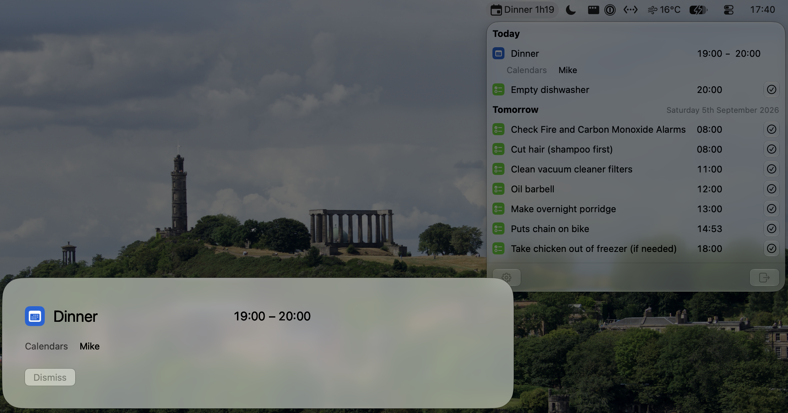

# 📅 MinMaxCal



MinMaxCal is a simple calendar and reminder app that lives in the menu
bar, not the Dock. Most of the time it shows only your next event or
reminder and a compact countdown. When that item is due, MinMaxCal takes
over every display with everything you need and one click to get where
you are going.

## 💡 Motivation

Calendar apps either hide in a window you forgot to look at or nag with
notifications you learnt to swipe away. MinMaxCal works at both
extremes: it is effortless to glance at and difficult to ignore when
something is due. It reads the calendars and reminder lists macOS
already has through EventKit, so it needs no separate account and keeps
your data on your Mac.

## ✨ Features

- The menu bar item shows the app icon, the next item's title and a
  compact countdown: `Weekly planning 1h52`.
- Clicking it opens today and tomorrow in time order, with calendar
  colours, the title, a Join or Complete button and start and end
  times.
- Expanding a row shows its calendars, location, organiser, attendees,
  response, recurrence and linked notes. Location text omits
  configurable home terms but opens the full address in Apple Maps.
- Past events and completed reminders disappear. An overdue reminder
  stays at the top until completed, then remains struck through with
  Undo for five minutes.
- Unanswered and tentative invitations show their status but never
  take over. Declined and cancelled events are hidden.
- Duplicate meetings merge across calendars by invitation ID or
  matching times and titles, retaining overlapping calendar colours.
- When an accepted event starts or a reminder is due, MinMaxCal covers
  every display, including full-screen apps. **Join** or **Complete**
  is the primary action, **Dismiss** sits on the left and reminders can
  be snoozed for a configured duration. Return triggers the primary
  action and Escape dismisses.
- MinMaxCal starts at login by default. Settings can turn this off and
  open the system approval pane when required.

## 🚫 Out of Scope

Anything EventKit's public APIs do not expose is either derived by a
documented rule or left out; private APIs are never used:

- **Accounts, servers and sync.** macOS owns all three; MinMaxCal reads
  their local EventKit data.
- **Travel time and leave alerts.** EventKit does not expose travel
  time; the takeover is at the start, not before it.
- **Answering invitations.** Unanswered invitations show their status
  and are answered in Calendar, as before.
- **Snoozing in Reminders.** Snooze is the app's own and never edits
  the reminder.
- **An updater.** Releases contain no updater; Homebrew handles
  upgrades.

## 📋 Requirements

- macOS 27 or later.
- Full access to Calendars is required. Reminders access is requested
  on first launch but can be declined.
- Optional: the Zoom app, Microsoft Teams and Microsoft Edge for
  opening calls in them.

## 📦 Installation

Download `MinMaxCal-<version>.zip` from the
[releases page](https://github.com/MikeMcQuaid/MinMaxCal/releases),
unzip it and move `MinMaxCal.app` to /Applications. Releases are signed
with a Developer ID certificate and notarised by Apple.

Releases will also ship as a Homebrew cask
(`brew install --cask minmaxcal`) as soon as the repository is notable
enough for
[Homebrew/homebrew-cask](https://github.com/Homebrew/homebrew-cask);
`brew upgrade` then updates the app.

To run the current source instead:

```bash
script/bootstrap
script/install
```

## ⚙️ Configuration

Settings opens from the agenda's footer or Cmd-, and controls:

- **Calendars**: selected calendars and reminder lists, grouped by
  account and shown in their colours.
- **Takeover**: event and reminder triggers, the alert sound, snooze
  durations.
- **Join**: the preferred app for Zoom, Teams, Meet, Jitsi, FaceTime
  and other links.
- **Matching**: generic titles to merge and home terms to omit from
  locations.
- **General**: launch at login, the menu bar title length and
  permissions.

## 🛠️ Development

- `script/bootstrap`: install `Brewfile` dependencies and generate the
  Xcode project with XcodeGen
- `script/build`: build the app; `MinMaxCal.app` in the repository root
  symlinks its output
- `script/install`: build, then copy the app to /Applications
- `script/zip`: zip the built app as `MinMaxCal-<version>.zip`
- `script/package`: sign, notarise and zip the app using credentials
  from the environment
- `script/test`: unit tests
- `script/style [--fix]`: SwiftLint and SwiftFormat, every rule on
- `script/analyze`: static analysis and dead code
- `script/icons`: render the menu bar `Leaf.svg` and app `AppMark.svg`
  to PNG previews

Both `script/build` and direct Xcode builds refresh the version from
Git before each build: the nearest reachable `MAJOR.MINOR.PATCH` tag,
or `0.0.0` without one.
The generated project remains usable after clearing `.build`; the
next scheme build restores the Git-derived version.

See [AGENTS.md](AGENTS.md) for the conventions and
[ARCHITECTURE.md](ARCHITECTURE.md) for the design.

## 🚧 Status

Stable: all the features I care about are implemented and the app is
mostly in maintenance mode.

MinMaxCal is primarily for @MikeMcQuaid's personal use. I'll consider
other features and settings only if they do not make the app worse for
me.

## 📮 Contact

[Mike McQuaid](mailto:mike@mikemcquaid.com)

## 📄 Licence

[AGPL-3.0](LICENSE).
