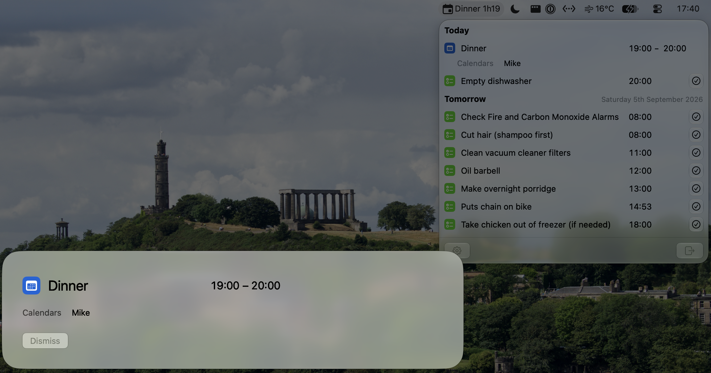

# 📅 MinMaxCal



MinMaxCal is a simple calendar and reminder app that lives in the menu
bar, not the Dock. Most of the time it shows only your next event or
reminder and a compact countdown. When that item is due, MinMaxCal takes
over every display with everything you need and one click to get where
you are going.

## 💡 Motivation

Calendar apps either hide in a window you forgot to look at or nag with
notifications you learnt to swipe away. MinMaxCal works at both
extremes: it is effortless to glance at and difficult to ignore when
something is due. It reads the calendars and reminder lists macOS
already has through EventKit, so it needs no separate account. Optional
calendar mirroring writes through those same macOS accounts.

## ✨ Features

- The menu bar item shows the app icon, the next item's title and a
  compact countdown: `Weekly planning 1h52`.
- Clicking it opens today and tomorrow in time order, with calendar
  colours, the title, a Join or Complete button and start and end
  times.
- Expanding a row shows its calendars, location, organiser, attendees,
  response, recurrence and linked notes. Location text omits
  configurable home terms but opens the full address in Apple Maps.
- Past events and completed reminders disappear. An overdue reminder
  stays at the top until completed, then remains struck through with
  Undo for five minutes.
- Unanswered and tentative invitations show their status but never
  take over. Declined and cancelled events are hidden.
- Duplicate meetings merge across calendars by invitation ID or
  matching times and titles, retaining overlapping calendar colours.
- Optional calendar mirroring maintains copies for the next calendar
  month while the app runs. Each pair chooses original title, location
  and links or a generic Busy or Travel title, with Busy-only and
  all-day filters. Configure pairs in **Settings → Sync**; syncing is
  off by default and originals are never changed. **Compare** previews
  changes without writing to calendars, with local validation and JSON
  reports available before enabling **Sync**.
- When an accepted event starts or a reminder is due, MinMaxCal covers
  every display, including full-screen apps. **Join** or **Complete**
  is the primary action, **Dismiss** sits on the left and reminders can
  be snoozed for a configured duration. Snooze uses the shortest
  duration; its menu offers all configured durations. The takeover
  takes keyboard focus: Return joins the call or completes the
  reminder, and Escape snoozes reminders for the shortest configured
  duration, dismissing instead when snooze is unavailable. The takeover
  closes automatically when its event ends or its reminder is completed,
  including in another app, and returns focus to the previous app.
- MinMaxCal starts at login by default. Settings can turn this off and
  open the system approval pane when required.
- Calendar changes refresh immediately. Idle fallback refreshes run
  every five minutes on mains power and every fifteen minutes on
  battery or in Low Power Mode. Countdowns still update each minute
  and takeover alarms keep their exact timing. Opening the agenda
  refreshes it too; an empty agenda needs no minute timer. Waking the
  Mac or its displays, or returning to the user session, refreshes the
  agenda and closes takeovers for items finished while away. The next
  takeover missed while asleep appears immediately if its item is still
  active. Refreshing a visible takeover does not replay its sound or
  announcement.

## 🚫 Out of Scope

Anything EventKit's public APIs do not expose is either derived by a
documented rule or left out; private APIs are never used:

- **Accounts and servers.** macOS owns accounts and provider syncing;
  MinMaxCal only reads and writes their local EventKit data.
- **Automatic scheduling.** Create focus and habit events in Calendar;
  MinMaxCal can mirror them but never chooses or rearranges their times.
- **Multiple sync computers.** Run calendar mirroring on one Mac only.
- **Travel time and leave alerts.** EventKit does not expose travel
  time; the takeover is at the start, not before it.
- **Answering invitations.** Unanswered invitations show their status
  and are answered in Calendar, as before.
- **Snoozing in Reminders.** Snooze is the app's own and never edits
  the reminder.
- **An updater.** Releases contain no updater; Homebrew handles
  upgrades.

## 📋 Requirements

- An Apple silicon Mac running macOS Tahoe (26) or later.
- Full access to Calendars is required. Reminders access is requested
  on first launch but can be declined.
- Optional: the Zoom app, Microsoft Teams and Microsoft Edge for
  opening calls in them.

## 📦 Installation

Install with Homebrew:

```bash
brew install --cask minmaxcal
```

`brew upgrade` updates the app.

Alternatively, download `MinMaxCal-<version>.zip` from the
[releases page](https://github.com/MikeMcQuaid/MinMaxCal/releases),
unzip it and move `MinMaxCal.app` to /Applications. Releases are signed
with a Developer ID certificate and notarised by Apple.
Releases publish only after the packaged app passes startup checks on
macOS Tahoe and macOS 27.

To run the current source instead:

```bash
script/bootstrap
script/install
```

## ⚙️ Configuration

Settings opens from the agenda's footer or Cmd-, and controls:

- **Calendars**: selected calendars and reminder lists, grouped by
  account and shown in their colours.
- **Sync**: calendar pairs, copied content, all-day and Busy-only
  filters, comparison and automatic mirroring.
- **Takeover**: event and reminder triggers, the alert sound, snooze
  durations.
- **Join**: the preferred app for Zoom, Teams, Meet, Jitsi, FaceTime
  and other links.
- **Matching**: generic titles to merge and home terms to omit from
  locations.
- **General**: launch at login, the menu bar title length and
  permissions.

## 🛠️ Development

- `script/bootstrap`: install `Brewfile` dependencies and generate the
  Xcode project with XcodeGen
- `script/build`: build the app; `MinMaxCal.app` in the repository root
  symlinks its output
- `script/install`: build, then copy the app to /Applications
- `script/zip`: zip the built app as `MinMaxCal-<version>.zip`
- `script/package`: sign, notarise and zip the app using credentials
  from the environment
- `script/test`: unit tests
- `script/style [--fix]`: SwiftLint and SwiftFormat, every rule on
- `script/analyze`: static analysis and dead code
- `script/icons`: render the menu bar `Leaf.svg` and app `AppMark.svg`
  to PNG previews

Both `script/build` and direct Xcode builds refresh the version from
Git before each build: the nearest reachable `MAJOR.MINOR.PATCH` tag,
or `0.0.0` without one.
The generated project remains usable after clearing `.build`; the
next scheme build restores the Git-derived version.

Builds treat compiler and linker warnings as errors, including Swift
memory-safety and soft-deprecation diagnostics. The build script keeps
all diagnostics visible and fails even when an older app bundle exists.
It refreshes the generated project when sources or settings change.
`script/style --fix` checks the final output with both Swift linters.
CI also runs the tests separately with Address Sanitizer and Thread
Sanitizer. Run them locally with `script/test --sanitize address` and
`script/test --sanitize thread`.

See [AGENTS.md](AGENTS.md) for the conventions and
[ARCHITECTURE.md](ARCHITECTURE.md) for the design.

## 🚧 Status

Stable: all the features I care about are implemented and the app is
mostly in maintenance mode.

MinMaxCal is primarily for @MikeMcQuaid's personal use. I'll consider
other features and settings only if they do not make the app worse for
me.

## 📮 Contact

[Mike McQuaid](mailto:mike@mikemcquaid.com)

## 📄 Licence

[AGPL-3.0](LICENSE).
